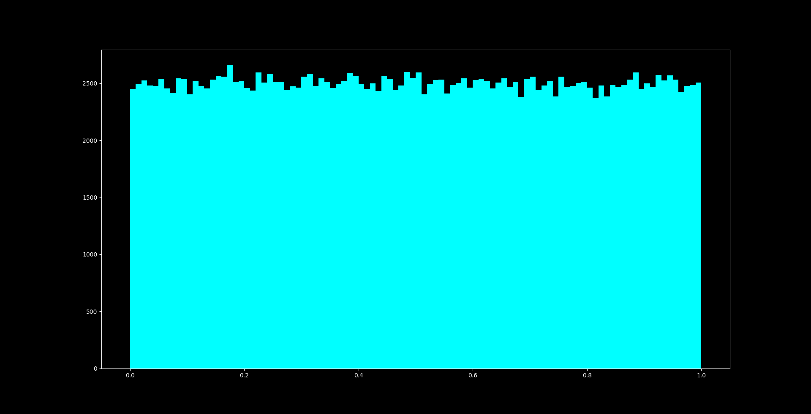

# Random Number Generator

It's a simple and quick written random number generator based on the "Logistic Map Bifurcation Diagram".
The algorithm is based on this tiny function:
```python
def f(r, x):
	return r*x*(1-x)
```
When you iterate this function with a constant value of r the x settles to a number. If r is increased the function bounces between 2 values. When you increase it further the number of values "bounce-values" doubles faster. At about r=3.6 x never settles. It is bouncing without any pattern. The function is chaotic. I use this characteristic to generate random numbers. By mapping the value you can even use the generated number to create a new seed. Therefore the numbers should not repeat in any pattern.

## Logistic Map Bifurcation Diagram


## Logistic Map Bifurcation Diagram (zoomed)
")

## Histogram of the random Numbers
To prove the equal distribution, I plotted a histogram. Obviously, there is a lot of noise. But if you compare it to the standard random function from python, it looks pretty similar.
